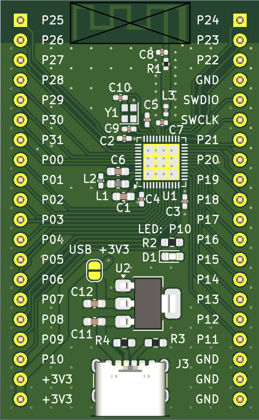

# nRF52832 development board

The project main intension is the first experiment in designing bluetooth hardware. Design is **not tested!**

The TI antenna SWRA117D is used (AN 043).

USB connector and voltage regulator circuitry are optional and only provide power.

