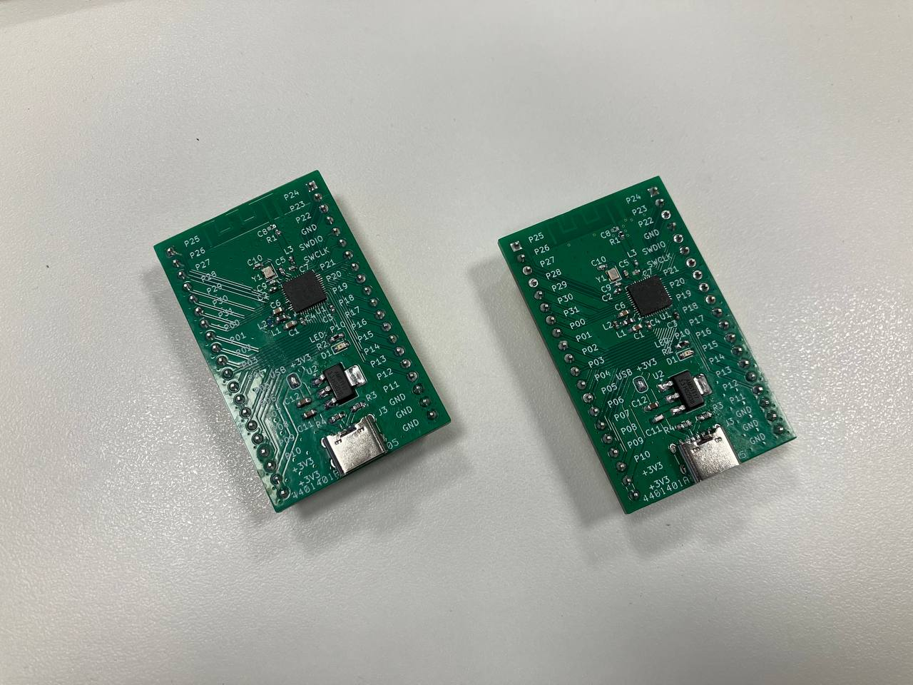

# nRF52832 development board

The project main intension is the first experiment in designing bluetooth hardware. Design is **not tested!**

The TI antenna SWRA117D is used (AN 043).

USB connector and voltage regulator circuitry are optional and only provide power.




## Known issues

It turns out that using P10 as an LED pin is not the best idea, as it is one of the NFC pins. To use it as a GPIO, you first need to disable the NFC pin protection. Using Rust and the nRF52832 PAC, this is done with the following code (the dedicated NVRAM register value should be set once and the new configuration is taken into account after MCU reset):

```rust
p.NVMC.config.write(|w| w.wen().wen());
p.UICR.nfcpins.write(|w| w.protect().disabled());
p.NVMC.config.reset();
```
